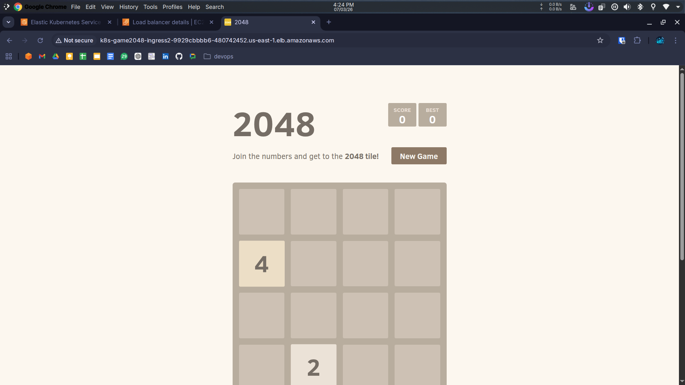

# 🚀 Deploy 2048 Game on AWS EKS using Fargate and ALB


This project demonstrates how to deploy the **2048 game application** on **Amazon EKS (Elastic Kubernetes Service)** using **AWS Fargate** and expose it using an **Application Load Balancer (ALB)**.

The goal of this project is to help beginners understand how Kubernetes workloads run on AWS **without managing servers**.

---

# 📌 Architecture Diagram


### Architecture Flow

1. User accesses the application using a browser.
2. Traffic reaches the **AWS Application Load Balancer (ALB)**.
3. ALB forwards requests to **Kubernetes Ingress**.
4. Kubernetes routes traffic to **2048 application pods**.
5. Pods run inside **AWS Fargate (serverless containers)**.
6. **AWS Load Balancer Controller** automatically manages the ALB.

---

# 🎮 Application Preview

Below is the running **2048 game deployed on AWS EKS**.



---

# 📁 Project Structure

```
eks-2048-demo
│
├── README.md
├── AWS EKS 2048 Game deployment diagram.png
├── game-running.png
```

---

# 🧰 Prerequisites

Make sure the following tools are installed.

* AWS CLI
* kubectl
* eksctl
* Helm
* Git

Verify installation:

```bash
aws --version
kubectl version --client
eksctl version
helm version
```

You also need:

* AWS account
* IAM user with administrator permissions

---

# 1️⃣ Configure AWS CLI

Configure AWS credentials.

```bash
aws configure
```

You will be asked for:

```
AWS Access Key ID
AWS Secret Access Key
Default region
Output format
```

Example:

```
Region: us-east-1
Output format: json
```

---

# 2️⃣ Create EKS Cluster using Fargate

Create the Kubernetes cluster.

```bash
eksctl create cluster \
--name mahe-demo-cluster \
--region us-east-1 \
--fargate
```

This automatically creates:

* EKS Control Plane
* VPC
* Subnets
* Security Groups
* Fargate Configuration

---

# 3️⃣ Connect kubectl to the Cluster

```bash
aws eks update-kubeconfig \
--name mahe-demo-cluster \
--region us-east-1
```

Verify connection:

```bash
kubectl get nodes
```

---

# 4️⃣ Create Fargate Profile

```bash
eksctl create fargateprofile \
--cluster mahe-demo-cluster \
--region us-east-1 \
--name alb-sample-app \
--namespace game-2048
```

This ensures all pods in the `game-2048` namespace run on **AWS Fargate**.

---

# 5️⃣ Deploy the 2048 Application

```bash
kubectl apply -f https://raw.githubusercontent.com/kubernetes-sigs/aws-load-balancer-controller/v2.5.4/docs/examples/2048/2048_full.yaml
```

This creates:

* Namespace
* Deployment
* Service
* Ingress

Verify pods:

```bash
kubectl get pods -n game-2048
```

---

# 6️⃣ Enable IAM OIDC Provider

```bash
eksctl utils associate-iam-oidc-provider \
--cluster mahe-demo-cluster \
--approve
```

This allows Kubernetes service accounts to use AWS IAM roles.

---

# 7️⃣ Download IAM Policy

```bash
curl -O https://raw.githubusercontent.com/kubernetes-sigs/aws-load-balancer-controller/v2.11.0/docs/install/iam_policy.json
```

---

# 8️⃣ Create IAM Policy

```bash
aws iam create-policy \
--policy-name AWSLoadBalancerControllerIAMPolicy \
--policy-document file://iam_policy.json
```

---

# 9️⃣ Create IAM Service Account

Replace `<YOUR_ACCOUNT_ID>` with your AWS account ID.

```bash
eksctl create iamserviceaccount \
--cluster=mahe-demo-cluster \
--namespace=kube-system \
--name=aws-load-balancer-controller \
--role-name AmazonEKSLoadBalancerControllerRole \
--attach-policy-arn=arn:aws:iam::<YOUR_ACCOUNT_ID>:policy/AWSLoadBalancerControllerIAMPolicy \
--approve
```

---

# 🔟 Install AWS Load Balancer Controller

Add Helm repository:

```bash
helm repo add eks https://aws.github.io/eks-charts
helm repo update eks
```

Install controller:

```bash
helm install aws-load-balancer-controller eks/aws-load-balancer-controller \
-n kube-system \
--set clusterName=mahe-demo-cluster \
--set serviceAccount.create=false \
--set serviceAccount.name=aws-load-balancer-controller \
--set region=us-east-1 \
--set vpcId=<YOUR_VPC_ID>
```

Verify deployment:

```bash
kubectl get deployment -n kube-system aws-load-balancer-controller
```

Expected output:

```
READY   UP-TO-DATE   AVAILABLE
2/2     2            2
```

---

# 1️⃣1️⃣ Get Application URL

Check ingress:

```bash
kubectl get ingress -n game-2048
```

Example output:

```
NAME           CLASS   HOSTS   ADDRESS
ingress-2048   alb     *       k8s-game2048-xxxx.us-east-1.elb.amazonaws.com
```

Open the **ALB URL in your browser** to play the **2048 game**.

---

# 🧹 Cleanup (Avoid AWS Charges)

Delete the cluster when finished.

```bash
eksctl delete cluster \
--name mahe-demo-cluster \
--region us-east-1
```

---

# 🧠 Key Learnings

* Creating EKS clusters using `eksctl`
* Running Kubernetes workloads using **AWS Fargate**
* Deploying applications on Kubernetes
* Using **AWS Load Balancer Controller**
* Exposing applications using **ALB Ingress**
* Managing **IAM roles for Kubernetes service accounts**

---

# 🛠 Technologies Used

* AWS EKS
* Kubernetes
* AWS Fargate
* Application Load Balancer (ALB)
* Helm
* IAM & OIDC
* kubectl
* eksctl

---

# ⭐ Useful Kubernetes Commands

Check pods

```bash
kubectl get pods -A
```

Check services

```bash
kubectl get svc -A
```

Check ingress

```bash
kubectl get ingress -A
```

---

# 👨‍💻 Author

Mahesh

DevOps | AWS | Kubernetes Learning Project
